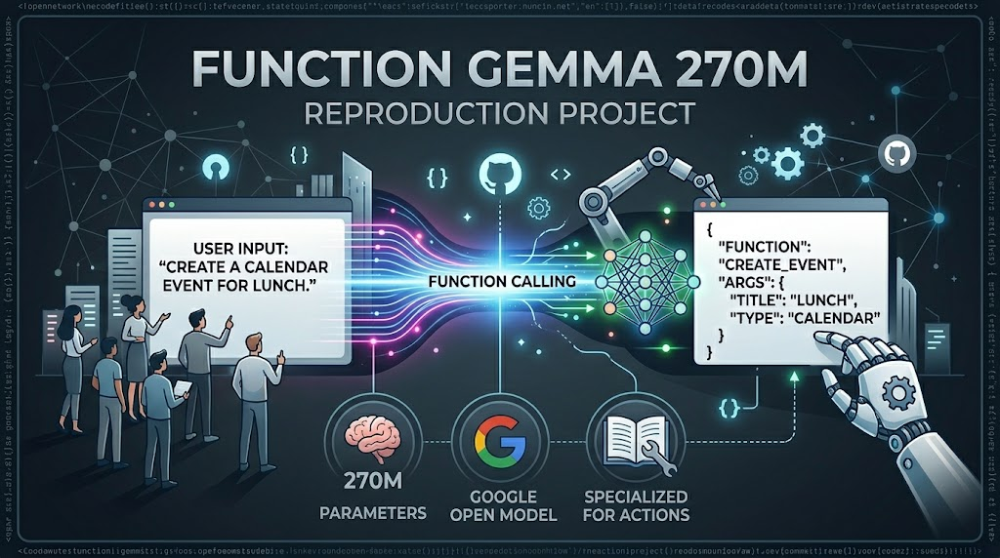
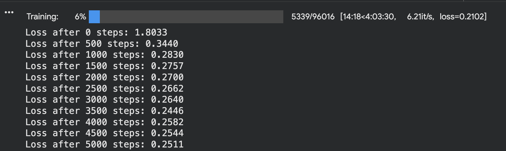
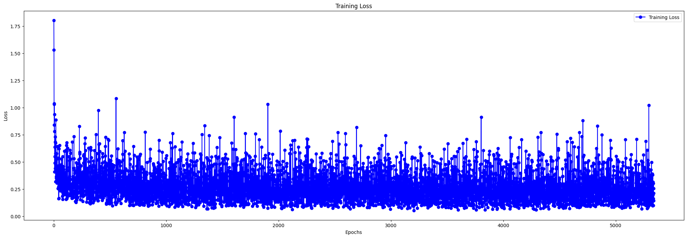
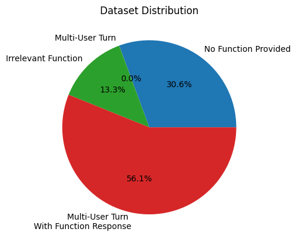
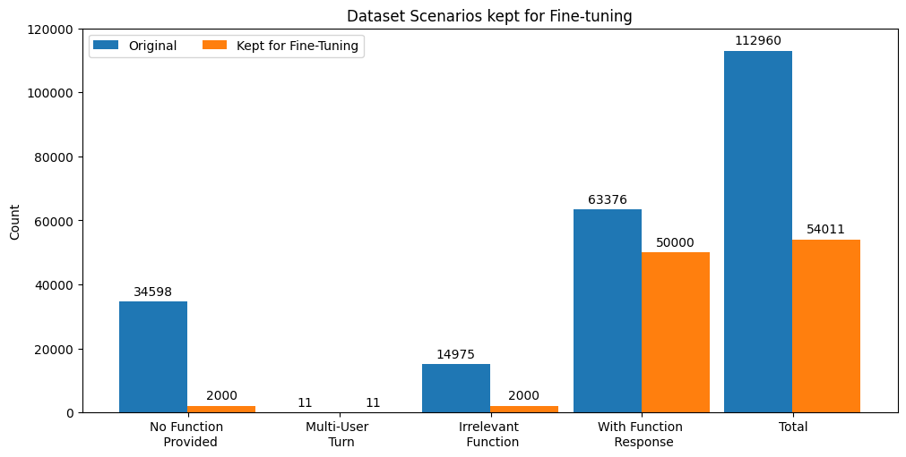
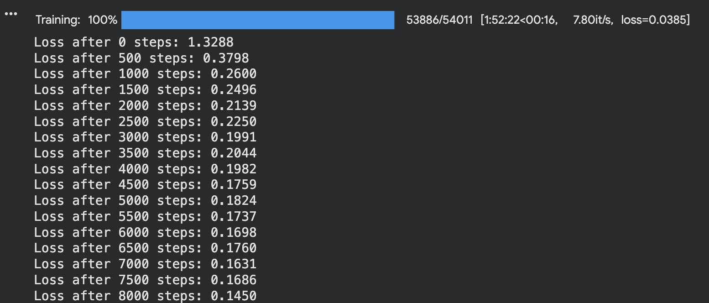
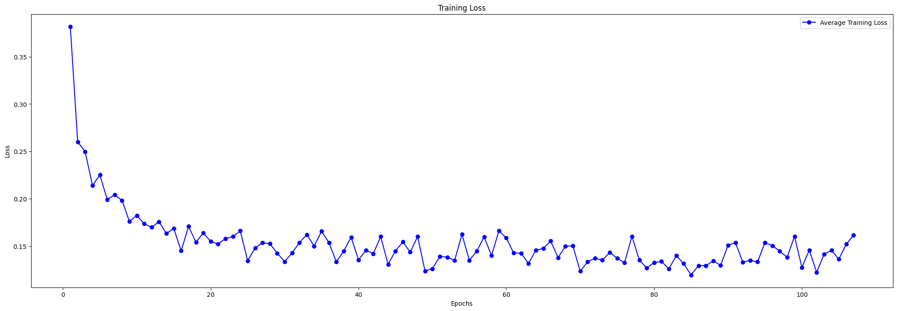
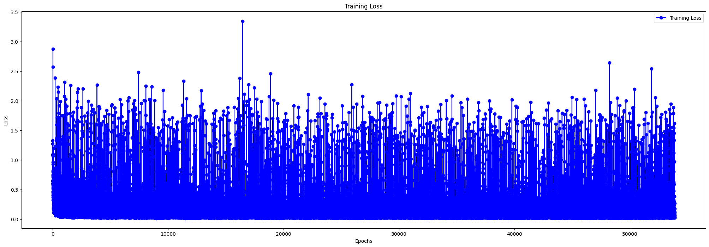
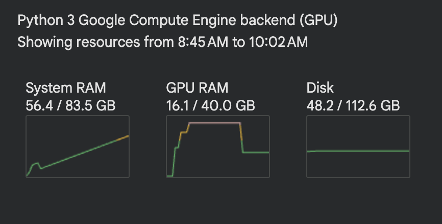

# Building Function Gemma (fine-tuned from Gemma-3 270M model)



The aim of this exercise is to produce a [Function Gemma](https://ai.google.dev/gemma/docs/functiongemma) like model.

> About Function Gemma: FunctionGemma is a specialized version of our `Gemma 3 270M` model tuned for function calling. It is designed as a strong base for further training into custom, fast, private, local agents that translate natural language into executable API actions.

Function Gemma is a **270 Million** parameter model, can be downloaded from [HuggingFace](https://huggingface.co/google/functiongemma-270m-it).

## Introduction

This repo focuses on reproducing a `Function Gemma` like model capable of function calling. Our model will take APIs / Functions documentation (structure) as an input from the user along with user's query and will perform Function Call with right arguments wherever needed.

> Note: The Functions / APIs structure is generally provided as a part of the System Instructions.

An Example User-Model communication will look like this:

```
SYSTEM: You are a helpful assistant with access to the following functions. Use them if required -
{
    "name": "calculate_factorial",
    "description": "Calculate the factorial of a given number",
    "parameters": {
        "type": "object",
        "properties": {
            "number": {
                "type": "integer",
                "description": "The number to calculate factorial for"
            }
        },
        "required": [
            "number"
        ]
    }
}

USER: Hi, I need to calculate the factorial of 5. Can you help me with that?


ASSISTANT: <functioncall> {"name": "calculate_factorial", "arguments": '{"number": 5}'} <|endoftext|>


FUNCTION RESPONSE: {"result": 120}


ASSISTANT: The factorial of 5 is 120. <|endoftext|>


USER: That was quick! Can you also calculate the factorial of 7?


ASSISTANT: <functioncall> {"name": "calculate_factorial", "arguments": '{"number": 7}'} <|endoftext|>


FUNCTION RESPONSE: {"result": 5040}


ASSISTANT: The factorial of 7 is 5040. <|endoftext|>


USER: Great! Thanks for your help.


ASSISTANT: You're welcome! If you have any other calculations or questions, feel free to ask. <|endoftext|>
```

To reproduce the Function Gemma model, we pick the existing [Gemma-3 270M](https://huggingface.co/google/gemma-3-270m) base model and fine-tune it on the Tool Calling dataset: [glaiveai/glaive-function-calling-v2](https://huggingface.co/datasets/glaiveai/glaive-function-calling-v2).

## Experiment 1

In my first experiment, I didn't explore much around data and straight away fine-tuned the Gemma-3 270 million parameter model on the Glaive Function Calling dataset.

I fine-tuned the model for around `5339` Steps where each step trained a batch of `8` (batch_size) items.
I achieved a final loss of `0.2511`.



### The Loss Curve:



The detailed inference analysis for the 1st experiment can be found [here](./inference_analysis/model_inference_analysis1.md)

## Experiment 2 & 3

In my second and third experiment I stressed on the data quality, to make sure we are capturing every scenario from the dataset and feeding to the base model.

I explored around the dataset and it currently has following scenarios:

### Scenario 1: No access to external function provided.

```
SYSTEM: You are a helpful assistant, with no access to external functions.

USER: Provide an example of a sentence that illustrates the use of future perfect tense.
ASSISTANT: I am a Function calling model, so you will have to provide me with some external function. <|endoftext|>
```

### Scenario 2: Irrelevant Function / User query doesn't align with any provided functions / tools

```
SYSTEM: You are a helpful assistant with access to the following functions. Use them if required -
{
    "name": "search_movie",
    "description": "Search for a movie by title",
    "parameters": {
        "type": "object",
        "properties": {
            "title": {
                "type": "string",
                "description": "The title of the movie to search for"
            }
        },
        "required": [
            "title"
        ]
    }
}

USER: Can you book a flight for me to New York?

ASSISTANT: I'm sorry, but as an AI, I don't have the capability to book flights. My current function allows me to search for a movie by its title. If you need information about a specific movie, feel free to ask! <|endoftext|>
```

### Scenario 3: Multi-User Turns

When user and agent chat with each other back to back.

```
SYSTEM: You are a helpful assistant with access to the following functions. Use them if required -
{
    "name": "generate_username",
    "description": "Generate a unique username",
    "parameters": {}
}


USER: Hi, can you help me with something?
ASSISTANT: Of course! That's what I'm here for. What do you need help with? <|endoftext|>
USER: I need you to book a flight for me from New York to London.
ASSISTANT: I'm sorry, but as an AI, I don't have the capability to book flights or perform any external tasks. My current function allows me to generate unique usernames. Is there anything else you need help with that's within my capabilities? <|endoftext|>
```

### Scenario 4: Multi-User Turn with Function Response

There are multiple user-agent interactions and addition to that the agent calls the function/tool, receive the response and reply back to the user accordingly.

```
SYSTEM: You are a helpful assistant with access to the following functions. Use them if required -
{
    "name": "create_contact",
    "description": "Create a new contact",
    "parameters": {
        "type": "object",
        "properties": {
            "name": {
                "type": "string",
                "description": "The name of the contact"
            },
            "email": {
                "type": "string",
                "description": "The email address of the contact"
            }
        },
        "required": [
            "name",
            "email"
        ]
    }
}


USER: I need to create a new contact for my friend John Doe. His email is johndoe@example.com.
ASSISTANT: <functioncall> {"name": "create_contact", "arguments": '{"name": "John Doe", "email": "johndoe@example.com"}'} <|endoftext|>
FUNCTION RESPONSE: {"status": "success", "message": "Contact for John Doe with email johndoe@example.com has been created successfully."}
ASSISTANT: I have successfully created a new contact for your friend John Doe with the email johndoe@example.com. <|endoftext|>
```

The overall distribution of the above 4 scenarios in the dataset visualized in the below chart.



| Scenario | Row Count |
| -------- | --------- |
| Total | 112960 |
| No Function Provided | 34598 |
| Multi-User Turn | 11 |
| Irrelevant Function | 14975 |
| Multi-User Turn With Function Response | 63376 |

For the Fine-Tuning process, I kept following amount of rows from each scenarios.



| Scenario | Rows Kept for Fine-tuning |
| -------- | --------- |
| Total | 54011 |
| No Function Provided | 2000 |
| Multi-User Turn | 11 |
| Irrelevant Function | 2000 |
| Multi-User Turn With Function Response | 50000 |

> Note: We kept only a small percentage from Scenario 1 & 2 since they presented same behavior throughout and hence providing a very small window for the model to learn.

### Training

I trained the model for around `1 hour 52 minutes` on the entire `54K` rows and achieved a **Loss** of around `0.15`.



### The Loss Curve:

The averaged loss per 500 itertions of training looked like this:



While the raw loss curve looks like this:



The detailed inference analysis for the 1st experiment can be found [here](./inference_analysis/model_inference_analysis3.md)

The Compute graphs during the entire training process looked like this:


