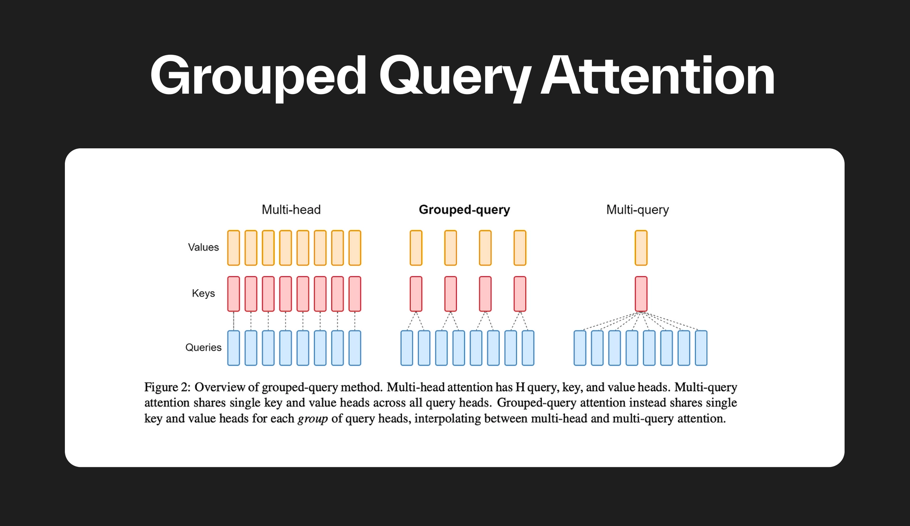

# Grouped Query Attention (GQA)

To understand GQA, we first need to understand the problem with standard Multi-Head Attention (MHA) during text generation (auto-regressive decoding).

In standard MHA, every single "Query" head has its own dedicated "Key" and "Value" (KV) head. When an LLM generates text one word at a time, it needs to remember the Keys and Values of all the previous words to avoid recomputing them. This memory is called the KV Cache.

  - The issue: As the sequence gets longer, the KV Cache gets massive. Loading this massive cache from GPU memory (VRAM) to the GPU compute cores for every single generated token becomes incredibly slow. It creates a memory bandwidth bottleneck.

## The Evolution: MHA $\rightarrow$ MQA $\rightarrow$ GQA

Researchers tried to fix this bottleneck, leading to three distinct architectures:

  - Multi-Head Attention (MHA): $1$ Query head gets $1$ Key head and $1$ Value head. Great quality, but slow generation and huge memory usage.
  
  - Multi-Query Attention (MQA): All Query heads share exactly $1$ Key head and $1$ Value head. Extremely fast generation and tiny memory usage, but can lead to a noticeable drop in model quality and capability.
  
  - Grouped Query Attention (GQA): The "Goldilocks" solution. We divide the Query heads into $G$ groups. Each group of Query heads shares exactly $1$ Key head and $1$ Value head.

If you have $32$ Query heads and $8$ KV heads, that means you have $8$ groups. Every $4$ Query heads will share $1$ Key and $1$ Value head. GQA gives you almost the exact same speed and memory benefits as MQA, but maintains the high quality of MHA.

We might wonder: Does repeating the KV heads waste memory, defeating the purpose of GQA? In this training/forward-pass implementation, yes, duplicating the tensors inside repeat_interleave uses temporary VRAM. However, this is primarily for training or simple batch processing.

In actual deployment (inference), highly optimized engines like vLLM or custom CUDA kernels (like FlashAttention) compute GQA without ever explicitly copying the KV tensors in memory. They just fetch the same KV values from the cache for the queries in that group, which is where the massive speedup occurs.

## References

  - GQA: Training Generalized Multi-Query Transformer Models from Multi-Head Checkpoints (Google Research): https://arxiv.org/pdf/2305.13245