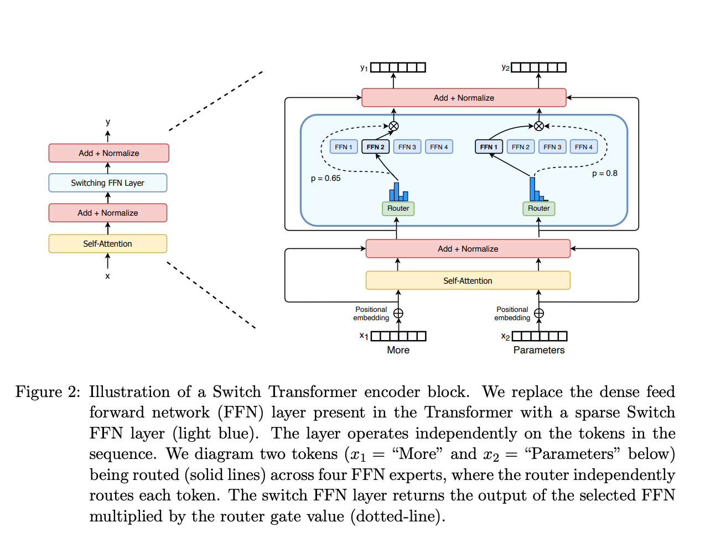

# Mixture of Experts



Imagine you run a consulting firm. You could hire a team of generalists who know a little bit about everything. They’ll do an okay job on most tasks, but they’ll struggle with highly complex, niche problems. Alternatively, you could hire a team of specialists—an accountant, a lawyer, an engineer, and a marketer—and hire a manager to route incoming client problems to the right expert.

MoE takes the second approach. Instead of forcing one massive neural network to learn everything, it divides the workload among multiple smaller, specialized networks (the "experts") and uses a "router" to decide which expert handles which piece of information.

## The Architecture: Where does MoE live?

In a standard Large Language Model (like the original GPT-3 or Llama 2), the architecture is made of stacked Transformer blocks. Each block has two main parts:

  1. Self-Attention: This helps the model understand the context of the sentence by looking at how words relate to each other.
  
  2. Feed-Forward Network (FFN): A dense neural network that acts as the model's memory and reasoning engine.
  
In an MoE model, the Self-Attention layers usually stay exactly the same. However, the single dense FFN is replaced by a Mixture of Experts layer.

This new layer contains:

  - The Experts: A set of $N$ separate, identical Feed-Forward Networks (e.g., 8 experts).
  - The Router (Gating Network): A small linear layer that looks at an incoming token (like a word) and predicts which experts are best equipped to process it.

## The Step-by-Step Flow

When a token enters the MoE layer, here is what happens:

  - The Assessment: The token is passed to the Router.
  - The Scoring: The Router calculates a probability score for every available expert.
  - The Routing (Sparse Activation): Instead of sending the token to all experts, the Router selects only the Top-$K$ experts (usually the top 1 or 2) to process the token.
  - The Merge: The chosen experts process the token, and their outputs are multiplied by their routing scores and added together.
  
Because we only activate a small subset of experts for any given token, this is called sparse activation.

### Code Walkthrough - MoE

To make it easy to understand, think of the `MoE` layer like a company dealing with a large batch of documents (the input x). Instead of having one giant machine process everything, the company has a "Router" (the boss) and a bunch of "Experts" (specialized teams). The boss looks at every single word (token) and decides which top 2 (top_k) experts are best suited to process it.

Here is how the code builds that system:

#### MoE Layer

```python
class MoELayer(nn.Module):
    """The Mixture of Experts Layer."""
    def __init__(self, in_dim, hidden_dim, num_experts, top_k=2):
        super().__init__()
        self.num_experts = num_experts
        self.top_k = top_k
```

- `class MoELayer...`: This defines the blueprint for our layer, inheriting from standard PyTorch modules.
- `def __init__(...)`: This runs when we first create the layer. It takes the input dimension (`in_dim`), the hidden size of the experts (`hidden_dim`), how many experts to create (`num_experts`), and how many experts get to look at a single token (`top_k`, defaulted to 2).

```python
self.router = nn.Linear(in_dim, num_experts, bias=False)
```

- `self.router = ...`: This is the "boss". It is a simple linear layer. It takes an input token and spits out a score for every single expert. If you have 8 experts, it spits out 8 numbers.

```python
self.experts = nn.ModuleList(
  [ Expert(in_dim, hidden_dim) for _ in range(self.num_experts)]
)
```

- `self.experts = ...`: This creates the actual teams of experts. `nn.ModuleList` is just a PyTorch way of holding a list of networks. It loops `num_experts` times, creating a new `Expert` network each time. (The `Expert` class is defined slightly higher up in the file—it's just a standard mini neural network).

#### Processing the Data - Forward Pass

```python
def forward(self, x):
  batch_size, seq_len, d_model = x.shape
  x_flat = x.view(-1, d_model)
```

- `def forward(self, x):`: This is where data actually flows through the layer. `x` is a 3D block of data (e.g., 2 sentences, 4 words each, 16 features per word).
- `x_flat = x.view(-1, d_model)`: To make things easier, we flatten all the words into one long line. We temporarily forget which sentence they belong to so the boss can evaluate them one by one.

```python
router_logits = self.router(x_flat)
routing_probs = F.softmax(router_logits, dim=-1)
```

- `router_logits`: The boss gives a raw score to every expert for every word.
- `routing_probs = F.softmax(...)`: Raw scores are hard to read, so `softmax` converts them into percentages (probabilities) that add up to 100%. (e.g., Expert 1: 10%, Expert 2: 50%, etc.)

```python
top_k_probs, top_k_indices = torch.topk(routing_probs, self.top_k, dim=-1)
top_k_probs = top_k_probs / top_k_probs.sum(dim=-1, keepdim=True)
```

- `torch.topk(...)`: The boss points at the top 2 (since `top_k=2`) highest-scoring experts for each word. It saves their probabilities (`top_k_probs`) and their ID numbers (`top_k_indices`).
- `top_k_probs / top_k_probs.sum(...)`: Because we threw away the other experts, our top 2 probabilities don't add up to 100% anymore. This math simply scales them up so they equal 100% relative to each other. (e.g., if they were 40% and 20%, they become ~66% and ~33%).

```python
final_output = torch.zeros_like(x_flat)
```

- `final_output = ...`: We create an empty canvas filled with zeros, exactly the same shape as our flattened input, to hold the final processed answers.

#### The Experts Go to Work

```python
for i, expert in enumerate(self.experts):
```

- `for i, expert...`: We go door-to-door, visiting every single expert (Team 0, Team 1, Team 2, etc.) one at a time to give them their assigned work.

```python
expert_mask = (top_k_indices == i)
token_indices = expert_mask.any(dim=-1)

if not token_indices.any():
  continue
```

- `expert_mask` & `token_indices`: We check the boss's assignments to find out exactly which words were assigned to this specific expert we are currently visiting.
- `if not ... continue`: If no words were assigned to this expert, we skip them entirely to save computing power.

```python
token_for_expert = x_flat[token_indices]
expert_output = expert(token_for_expert)
```

- `token_for_expert`: We gather all the specific words assigned to this expert.
- `expert_output = expert(...)`: This is the heavy lifting! We pass those gathered words through the expert's neural network to get their processed output.

```python
weight_indices = expert_mask[token_indices].nonzero(as_tuple=True)[1]
token_weights = top_k_probs[token_indices, weight_indices].unsqueeze(-1)
```

- `weight_indices` & `token_weights`: The boss didn't just assign the work; the boss also said how much to trust this expert's work based on their probability score. This code retrieves that specific scaled probability percentage we calculated earlier.

```python
final_output[token_indices] += expert_output * token_weights
```

- `final_output[...] += ...`: We take the expert's answer, multiply it by the "trust" percentage (the weight), and add it to our previously empty canvas. Because `top_k=2`, another expert will also add their weighted answer for this same token later in the loop.

#### Putting it all back together

```python
return final_output.view(batch_size, seq_len, d_model)
```

- `return final_output.view(...)`: Once all experts have done their jobs and added their weighted answers to the canvas, we reshape that flat canvas back into the original 3D shape (batch of sentences) and hand it off to the next layer in the LLM.


## References

  - Cai, W., Jiang, J., Wang, F., Tang, J., Kim, S., & Huang, J. (2024). A Survey on Mixture of Experts in Large Language Models. IEEE Transactions on Knowledge and Data Engineering (TKDE) 2025. https://arxiv.org/pdf/2407.06204 (Cited by: 370)

  - Jiang, A. Q., Sablayrolles, A., Roux, A., Mensch, A., Savary, B., Bamford, C., ... & Lacroix, T. (2024). Mixtral of Experts. arXiv. https://arxiv.org/pdf/2401.04088 (Cited by: 3294)